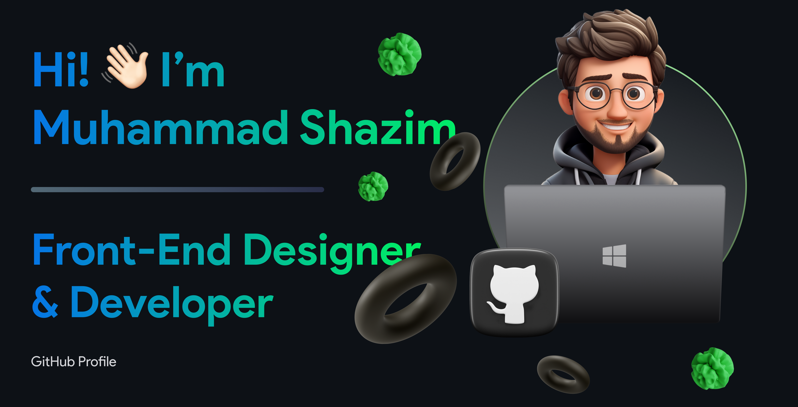

  

## 💬 About Me!

**Welcome to my GitHub profile!** 👨🏻‍💻

  I'm a passionate 3rd-year Software Engineering undergrad and Front-end Developer From Pakistan 🌍. My journey in the tech world started with building a strong foundation in Web Development, and I'm constantly exploring and mastering new front-end technologies. I thrive on challenges and love to dive deeper into this dynamic industry to gain practical experience💡. Collaborating with experienced professionals excites me, and I can't wait to contribute to impactful projects that make a difference. Besides coding, I'm also a skilled UI/UX designer 🎨.I have a great understanding of the laws governing design, enabling me to craft user-friendly and visually appealing experiences.As I continue to expand my skillset and passion for creativity 🚀, I'm thrilled to share my projects and progress with the amazing GitHub community. Let's connect, collaborate, and make a mark in the tech world together! Feel free to explore my repositories and don't hesitate to reach out for collaboration opportunities. Happy coding! 😊

 

**From Lines of Code to Personal Interests:**

- 🌱  Currently, I'm on an exciting learning journey with Flutter.
- 🧠  Unbounded Passion for Coding and Tech, Eager to Expand Skills in Diverse Tech Domains.
- 🎮  Passionate Gaming Enthusiast, Thriving in Virtual Worlds and Embracing Challenging Gameplay.
- 📫  How to reach me: [aslamshazim20@gmail.com](mailto:aslamshazim20@gmail.com)
- ⚡  Fun fact: I'm a self-proclaimed foodie, and I never miss a chance to try out new cuisines and exotic dishes. Exploring the world through food is my idea of a perfect adventure! 🍔🍣

  
  

## 💡 Skills

### ⚡Tech Stack

### 🛠️ Tools

## 🌐 Socials

 
  
  
  
   
  

 
## 📈 My GitHub Stats
    

 

